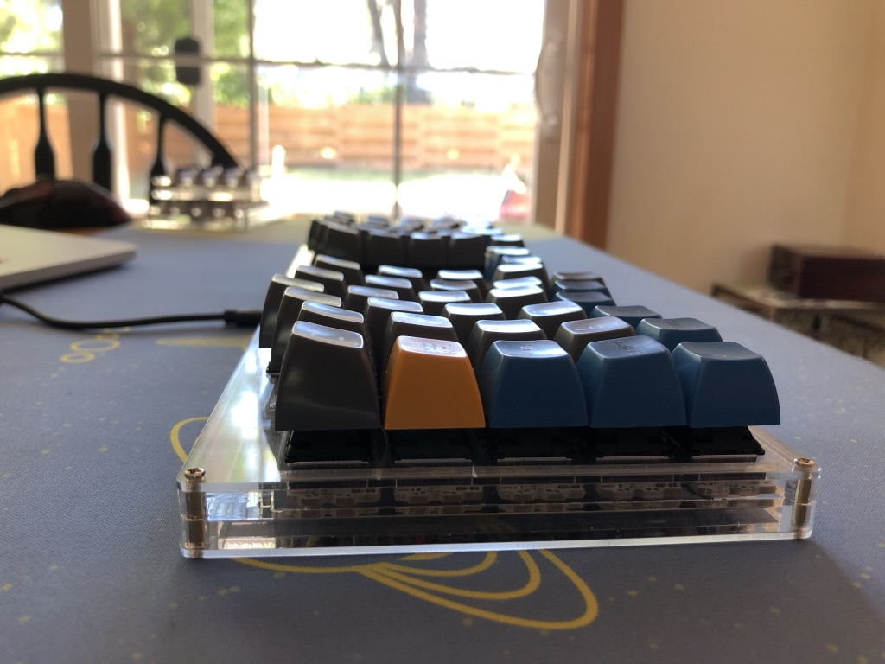

# Onboard Keystroke Encryption QMK Firmware

* Keyboard Maintainer: [Eric Boettner](https://github.com/boettner-eric)
* Hardware Supported: Proton C, SSD1305 128x32 Oled,
* Pinout

Proton C  | | | .
--- | --- | --- | ---
 | 5V | A9 |
Oled #1 | GND | A10 |
 | DFU | GND |
Oled #2 | 3.3V | GND |
Col 1 | A2| B7 | Oled SDA
Col 2 | A1 | B6 | Oled SCL
Col 3 | A0 | B5 |
Col 4| B8 | B4 | Enc A
Col 5 | B13 | B3 | Enc B
Col 6 | B14 | B2 |
Col 7 | B15 | B1 |
Col 8 | B9 | B0 | Col 9
Oled RST | B10 | A4 | Col 10
Row 1 | B11 | A5 | Col 11
Row 3 | B12 | A6 | Col 12
Row 2 | A14 | A7 | Col 13
Row 4 | A13 | A8 | Col 14
 | RST | A15 | Row 5

* "-" denotes an unused pin

Make example for this keyboard (after setting up your build environment):

    make key_crypt:default:dfu-util

See the [build environment setup](https://docs.qmk.fm/#/getting_started_build_tools) and the [make instructions](https://docs.qmk.fm/#/getting_started_make_guide) for more information. Brand new to QMK? Start with our [Complete Newbs Guide](https://docs.qmk.fm/#/newbs).
