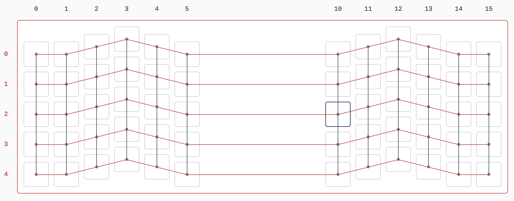

# Hardware
* This section of the repo contains all the hardware design files necessary for replicating this project.
* This readme will serve as an instruction manual for building Key Crypt

## Parts
* 5 Acrylic plates for laser cutting
* 62 key switches (plate mount)
* 62 [Amoeba switch pcbs](https://keeb.io/products/amoeba-single-switch-pcbs?variant=12960782024798)
* 62 1N4148 through hole diodes
* [Adafruit 2.42" Oled display](https://www.adafruit.com/product/2719)
* [Proton C micro controller](https://keeb.io/collections/frontpage/products/qmk-proton-c)
* Breadboard
* 2 feet of colored wires (colored sleeving)
* (This is all tentative)

## Guide
* As I have not finished the prototype build this section will stay empty while I work out the details
* I will be adding clear photos and tips here
* [Key Layout](http://www.keyboard-layout-editor.com/##@_name=Thesis%20Keyboard&author=Eric%20Boettner&notes=A%2060%25%20layout%20without%20the%20need%20for%20layers.%0ADesigned%20for%20my%20encryption%20based%20QMK%20project.%0AWill%20be%20handwired%20with%20Amoeba%20PCBs,%20a%20Proton%20C%20and%20a%202.43in%20Oled%20screen.%0A%0AMode/:%20quick%20switch%20between%20secure%20input%20and%20normal%20keyboard%20passthrough%0AMenu/:%20redirect%20keyboard%20input%20to%20console%20on%20oled%20for%20settings%20and%20secure%20entry%20functions%0ASend/:%20send%20current%20secure%20input%20buffer%20through%20aes%20and%20across%20usb%0A%0A*%20based%20on%20the%20minivan%2040%25%20layout&switchMount=cherry&switchBrand=cherry&switchType=MX3A-L1xx&plate:true;&@_x:4.5&a:7&w:2.75&h:2;&=Oled;&@_y:-0.5&x:2.5&w:2&h:1.25;&=ATmega;&@_y:0.75&c=#7d7b82&t=#f5f1f1&a:5;&=~%0A%60&_t=#ffffff;&=!%0A1&=/@%0A2&=#%0A3&=$%0A4&=%25%0A5&=%5E%0A6&=/&%0A7&=*%0A8&=(%0A9&=)%0A0&=/_%0A-&=+%0A/=&=%7C%0A%5C;&@_a:7&w:1.25;&=Tab&=Q&=W&=E&=R&=T&=Y&=U&=I&=O&=P&_a:5;&=?%0A//&_a:7&w:1.75;&=BS;&@_w:1.5;&=Esc&=A&=S&=D&=F&=G&=H&=J&=K&=L&_a:5;&=/:%0A/;&=%22%0A'&_a:7&w:1.5;&=Enter;&@_w:1.75;&=Shift&=Z&=X&=C&=V&=B&=N&=M&_a:5;&=%3C%0A,&=%3E%0A.&=%7B%0A%5B&=%7D%0A%5D&_a:7&w:1.25;&=Send;&@_x:1;&=Ctrl&=Alt&=Meta&=Menu&_w:4;&=&=Left&=Down&=Up&=Right)

